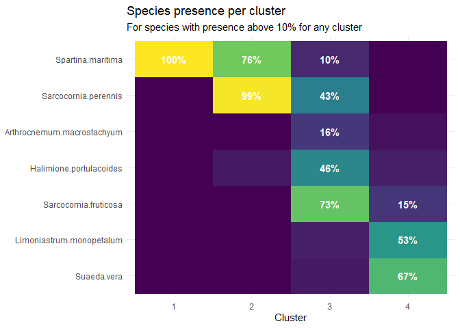
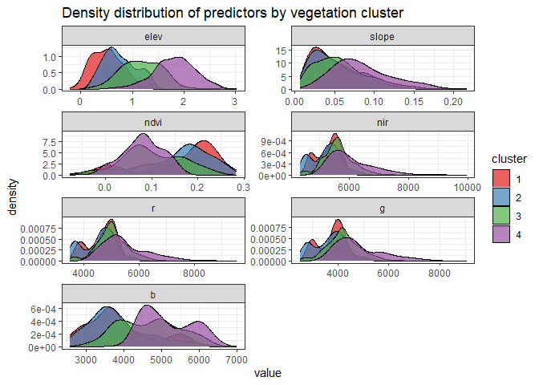

Remote sensing classification of saltmarshes in the Ria Formosa
================

## TODO

Add some images to display the intermediate and final results Finish
explaining the whole process Re-factor code and add some extra comments

## Summary

Here I summarize the methods used during my work at mapping the
saltmarsh communities in the Ria Formosa lagoon (South Portugal).

For this project, transects were performed along saltmarsh fringes. A
1x1 m quadrat was overlaid across the entire transect and species
presences were recorded. These quadrats were then clustered into one of
3 possible saltmarsh communities.

Satellite imagery and LIDAR data were combined and used to extract the
spectral signatures and preferred elevation of each saltmarsh community.
This information was used to determine which community exists in each
site of the Ria.

The project was fully implemented in open source, via a combination of R
and QGIS (working on moving it fully to R, and making it fully
compatible with the newest versions of rspatial packages). Because some
of the code required is quite extensive, I do not include all of the
code in this README. In particular, the data pre-processing has been
glossed over. However, I refer to the script files that go over that
specific task, and you can find them in the *code* folder.

## Settings and global variables required

The entire project uses a wide variety of R packages, especially for all
spatial data handling.

``` r
library(readxl)   # Read xlsx files
library(raster)   # Tools to handle rasters - to be replaced with terra
library(dplyr)    # Data wrangling
library(tidyr)    # Data wrangling
library(sf)       # Simple features - spatial vector data 
library(vegan)    # Ecology analysis functions - for bray curtis distances
library(purrr)    # Functional programing
library(ggplot2)  # Grammar of graphics - plotting
library(scales)   # Function to format scales for visualization
library(forcats)  # Tools to modifying factor levels (ploting purposes)
```

I also need the proj4 strings describing the WGS84 and PT-TM06/ETRS89
coordinate reference systems.

``` r
# Proj4 string for CRS PT-TM06/ETRS89
pt_crs <- "+proj=tmerc +lat_0=39.66825833333333 +lon_0=-8.133108333333334 +k=1 +x_0=0 +y_0=0 +ellps=GRS80 +units=m +no_defs "
# Proj4 string for CRS WGS84
wgs84_crs <- "+proj=longlat +ellps=WGS84 +datum=WGS84 +no_defs "
```

## Estimating quadrat positions

During field work, we recorded the starting and ending points of the
transects in the GPS. However, for properly extracting the visual and
terrain properties, we must have centroids for each quadrat.

To do so, I defined custom functions to: 1. Calculate the orientation of
a transect (relative to North) 2. Break a transect into k points, where
k = number of quadrats 3. Draw a square with defined size and
orientation, so that one corner of the quadrat is at the given point

> You can find them in helper\_functions.R

With these tools I can, having only the start and end points of the
transects, estimate the center position for all recorded quadrats. While
I could have saved the quadrat centroids directly, I decided to save the
entire quadrat (for visualization and because it helped immensely in
debugging).

With those basic tools, I all I had to do was load the transect
information, shape it into the required format and then apply them. \>
Script 1\_draw\_quadrats.R

The output of this was a shapefile where each individual quadrat is a
polygon. Those polygons have all the identifying information required to
connect them to the transect where they belong.

## Creating vegetation community clusters

Using individual species data to classify the saltmarshes would lead to
very noisy estimates. However, we know that saltmarsh species tend to
form communities (mostly based around their hydroperiod). I decided to
use hierarchical clustering to create clusters, based on the Sørensen
index (AKA the binary Bray-Curtis index). These clusters (or
communities) will be our target variable (what we want to predict)

> Scrit 2\_community\_cluster.R

I ended up opting for using 4 clusters (Figure 1), as it seemed to make
the most sense based on what we had observed in the field. One community
comprised only of *Spartina maritima*, the pionner species, which tended
to form the first frienge near the water (cluster 1). Oftentimes, *S.
maritima* is found with *Sarcocornia perennis*, forming the cluster 2.
Cluster 3 is formed of species that tend to be even higher in the
intertidal (or even in the supratidal), both *Sarcocornia* species as
well as *Halimione portulacoides*. Some *Arthrocnemum macrostachyum* was
also common, although this tended to be in the limits of the intertidal.
Cluster 4 is composed of the more bush-like species and was generally
found in the supratidal area, when saltamarsh started to transition into
dunes.

``` r
spp_quadrats <- st_read("./outputs/quadrats_species/quadrats_species.gpkg")
```

    ## Reading layer `quadrats_species' from data source `C:\Users\marci\OneDrive - Universidade do Algarve\04_others\RiaFormosa_saltmarsh_classification\outputs\quadrats_species\quadrats_species.gpkg' using driver `GPKG'
    ## Simple feature collection with 1538 features and 36 fields
    ## geometry type:  POLYGON
    ## dimension:      XY
    ## bbox:           xmin: 9770.353 ymin: -299877.8 xmax: 46398.95 ymax: -281468.5
    ## proj4string:    +proj=tmerc +lat_0=39.66825833333333 +lon_0=-8.133108333333334 +k=1 +x_0=0 +y_0=0 +ellps=GRS80 +units=m +no_defs

``` r
presence_in_cluster <- spp_quadrats[,c(8:34, 36)] %>%
  st_drop_geometry() %>%
  filter(cluster != "unvegetated")%>%
  gather(key = "species", value = "presence", 1:27) %>%
  group_by(cluster, species) %>%
  summarise(prop_presences = sum(presence)/n()) %>%
  ungroup() 

# Get list of species which are present in more than 10% of any cluster
common_sp <- presence_in_cluster %>%
  filter(prop_presences > 0.1) %>%
  pull(species) %>%
  unique()

presence_in_cluster %>%
  filter(species %in% common_sp) %>%
  mutate(species = fct_reorder2(species, cluster, prop_presences)) %>%
  ggplot(aes(x = cluster, 
             y = species, 
             fill = prop_presences)) +
    geom_raster() +
    geom_text(aes(label = 
      ifelse(prop_presences > 0.1, 
             percent(prop_presences, accuracy = 1),
             NA)),
      color = "white",
      fontface = "bold") +
    scale_fill_viridis_c(guide = FALSE) +
    labs(title = "Species presence per cluster",
         subtitle = "For species with presence above 10% for any cluster",
         y = NULL,
         x = "Cluster") +
    theme_minimal()
```



## Community predictor features

We now have the coordinates for the quadrats and and the target
variable. To create a predictive model we just need features that help
identify which kind of community we find in a new site. These will be
our predictors.

Feature selection and engineering can (and often is) a laborsome task
and of extreme importance for state of the art model performance.
However, for this work, I did not go deep into this, as the work
performed here was already stretching my knowledge and skills.

> Notes: In the future, dwelling into proper feature engeniering is one
> of my goals, especially since the work we have planned will not have
> such good data availability. <https://bookdown.org/max/FES/> has a
> nice overview of typical approaches;
> <https://nowosad.github.io/post/lsm-bp2/> has implemented many common
> landscape metrics;
> <http://www.seascapemodels.org/rstats/2020/02/08/calculating-distances-in-R.html>
> distances can be used as proxies for elevation (?) when LIDAR data is
> not available

The available data for this was: a LIDAR digital elevation model with a
10 meter resulution (elevation and slope); multispectral raster data
(bands: Near infrared, Red, Green, Blue) with a 3 meter resolution
(obtained from planet.com). The one feature engineering I did was
calculated the normalized difference vegetation index (NDVI). This is
the most basic index used for analyzing vegetation and is also
correlated to water content in the soil, both of which are properties I
except to help separate these communites.

The variables at the centroid of each quadrat were extracted from these
rasters, and upsampled using bilinear interpolation. The interpolation
is important, as the quadrats are at a distance of \~ 1 m, lower than
the available resolution. Allowing interpolation to be used should allow
for a better estimation of the quadrat’s true properties.

``` r
training_features <- st_read("./outputs/quadrats_train_features/quadrats_train_features.gpkg") %>%
  st_drop_geometry() %>%
  mutate(station = group_indices(., water_body, site_nr)) %>%
  # Station 10 has some quadrats that do not onverlay our raster
  filter(station != 10) %>%
  select(6:13) %>%
  pivot_longer(
    cols = c("elev", "slope", "ndvi", "nir", "r", "g", "b"),
    names_to = "var",
    values_to = "value"
  ) %>%
  mutate(var = factor(var, levels = c("elev", "slope", "ndvi", "nir", "r", "g", "b")))
```

    ## Reading layer `quadrats_train_features' from data source `C:\Users\marci\OneDrive - Universidade do Algarve\04_others\RiaFormosa_saltmarsh_classification\outputs\quadrats_train_features\quadrats_train_features.gpkg' using driver `GPKG'
    ## Simple feature collection with 1491 features and 13 fields
    ## geometry type:  POLYGON
    ## dimension:      XY
    ## bbox:           xmin: 9770.353 ymin: -299877.8 xmax: 46398.95 ymax: -281468.5
    ## proj4string:    +proj=tmerc +lat_0=39.66825833333333 +lon_0=-8.133108333333334 +k=1 +x_0=0 +y_0=0 +ellps=GRS80 +units=m +no_defs

``` r
ggplot(training_features) +
  geom_density(
    aes(x = value, fill = cluster),
    alpha = 0.7) +
  labs(
    title = "Density distribution of predictors by vegetation cluster"
  ) +
  scale_fill_brewer(
    type = "qual",
    palette = "Set1"
  ) +
  facet_wrap(
    vars(var),
    scales = "free",
    ncol = 2) +
  theme_bw()
```



We can see from figure 2 that there are differences in elevation, slope,
ndvi and blue between our target classes. Separation is, obviously, not
perfect but note that we are looking at the univariate distributions of
these properties, while some of the more complex models will consider
interactions between them. It’s also quite clear that cluster 1 and 2
are very similar and might be hard to distinguish.

## Model training and selection

### Data split

### Model tuning

### Model selection

## Prediction saltmarsh communities
